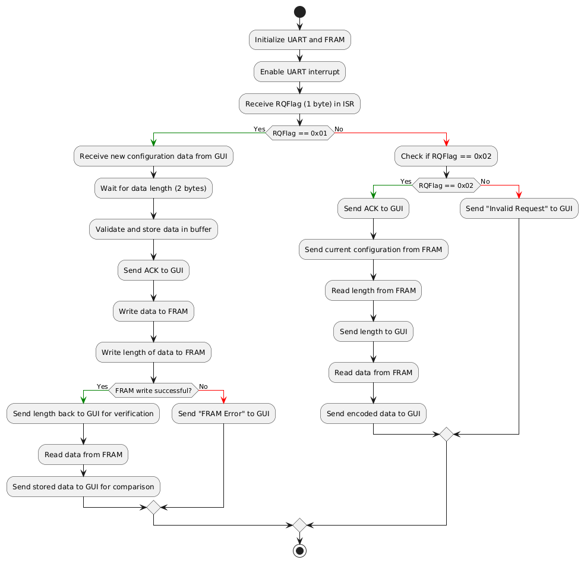
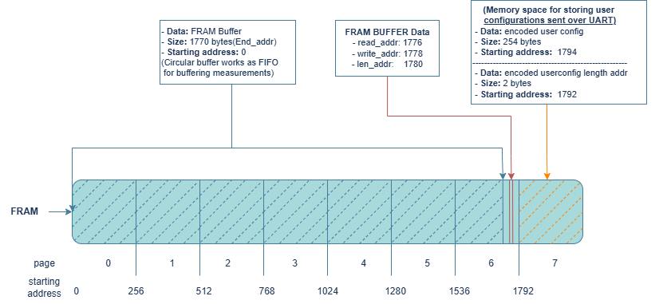

# Soil Power Sensor `userConfig` Library

**Author:** Ahmed Hassan Falah  
**Date:** 10/30/2024  
**Description:** The `userConfig` library enables efficient handling of user configuration data via UART communication and storage in FRAM on the STM32. It supports receiving and processing configuration data both via interrupt-driven and polling methods, writing the data to FRAM, and retrieving it when needed.

---

## Overview

The `userConfig` library initializes UART for interrupt-based data reception and handles incoming user configuration data. It writes and reads this data to and from the FRAM memory. The data length is stored alongside the encoded data in FRAM for easy retrieval.

## Features

- **UART Data Reception:** Uses interrupt-driven and polling methods to receive configuration data.
- **FRAM Data Storage:** Saves encoded configuration data in FRAM, along with its length.
- **Acknowledgment Messages:** Sends acknowledgment (`ACK`) to indicate successful data receipt.
- **Data Verification:** Ensures received data fits within the RX buffer, with error messaging if exceeded.

## Code Flow Diagram

The diagram illustrates the flow of code, from UART data reception to FRAM storage and acknowledgment transmission. It shows how the data is processed, validated, and stored in FRAM.

## FRAM Memory Usage

This diagram represents the FRAM memory layout, specifying where user configuration data and its length are stored.

## Memory Map

| Parameter                     | Address Hex (Dec)  | Length (Bytes) |
|-------------------------------|--------------------|----------------|
| **FRAM Start Address**        | `0x0700`    (1792) | -              |
| Encoded UserConfig Data       | `0x0700`    (1792) | 254 max        |
| Encoded UserConfig Data Length| `0x07FE`    (2046) | 2              |
| Total FRAM Usage              | -                  | 256            |

The configuration data length parameter ensures that the library only reads the necessary amount of data from FRAM.
